<div align="center">

# 🎨 **Catppuccin Dark Pro**

  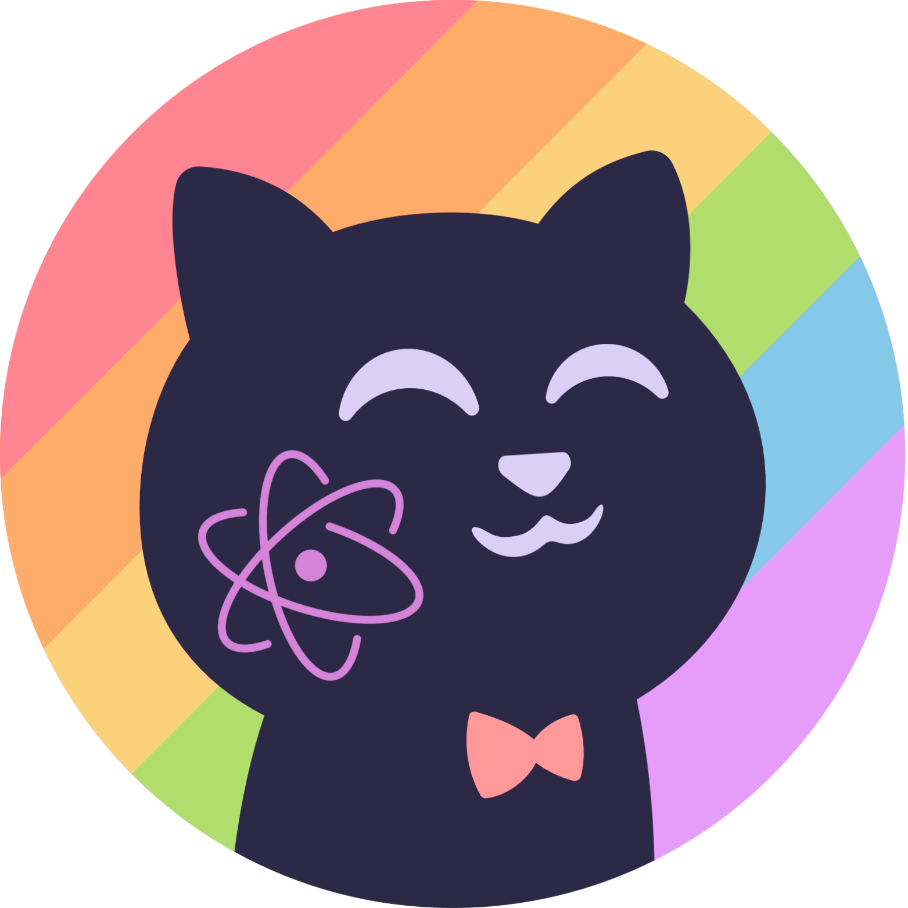

**The Ultimate Hybrid VS Code Theme**

[](https://marketplace.visualstudio.com/items?itemName=catppuccin-dark-pro.catppuccin-dark-pro)
[](https://marketplace.visualstudio.com/items?itemName=SharifdotG.catppuccin-dark-pro)
[](LICENSE)
[](https://code.visualstudio.com/)

</div>

---

<div align="center">

## 🌙 **Catppuccin Mocha UI** + 💡 **One Dark Pro Syntax** = ✨ **Perfect Harmony**

*The only theme that combines the elegant, modern aesthetics of Catppuccin Mocha with the battle-tested syntax highlighting of One Dark Pro. Featuring comprehensive semantic highlighting and ultra-flat design philosophy for the modern developer.*

  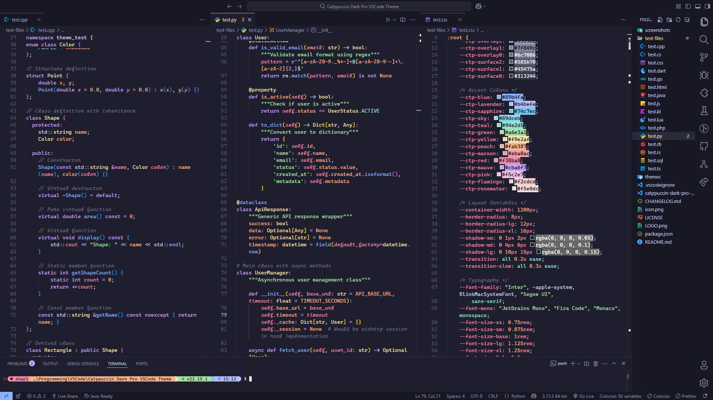
</div>

## 📸 Screenshots Gallery

*Experience Catppuccin Dark Pro across 15+ programming languages with optimized syntax highlighting*

### 🌐 **Web Development**

<details>
<summary><strong>🟨 JavaScript</strong> - Modern ES6+ with perfect token distinction</summary>

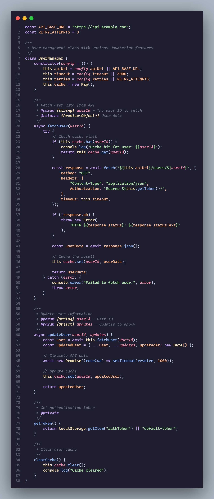
*Featuring enhanced template literals, arrow functions, and destructuring patterns*
</details>

<details>
<summary><strong>🔷 TypeScript</strong> - Advanced type annotations and intellisense</summary>

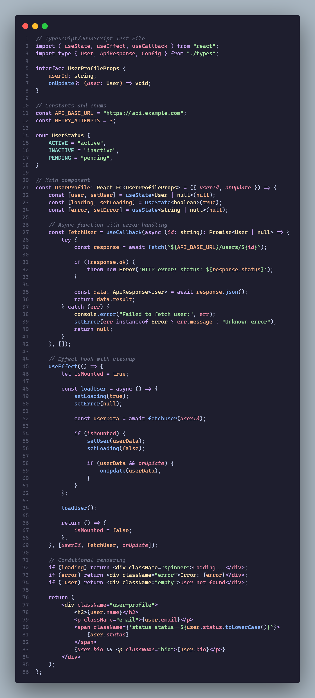
*Complete type safety visualization with interfaces, generics, and decorators*
</details>

<details>
<summary><strong>🎨 CSS</strong> - Modern styling with perfect property highlighting</summary>

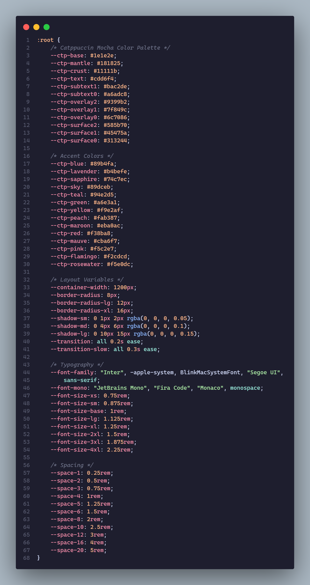
*Beautiful property-value distinction with vendor prefixes and CSS variables*
</details>

<details>
<summary><strong>📄 HTML</strong> - Clean markup with semantic tag recognition</summary>

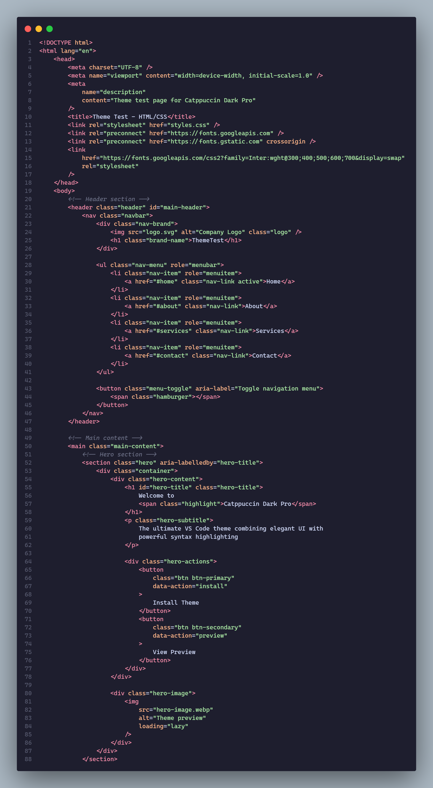
*Elegant tag hierarchy with attribute highlighting and semantic HTML5*
</details>

### ⚙️ **Systems Programming**

<details>
<summary><strong>🦀 Rust</strong> - Memory-safe systems programming perfection</summary>

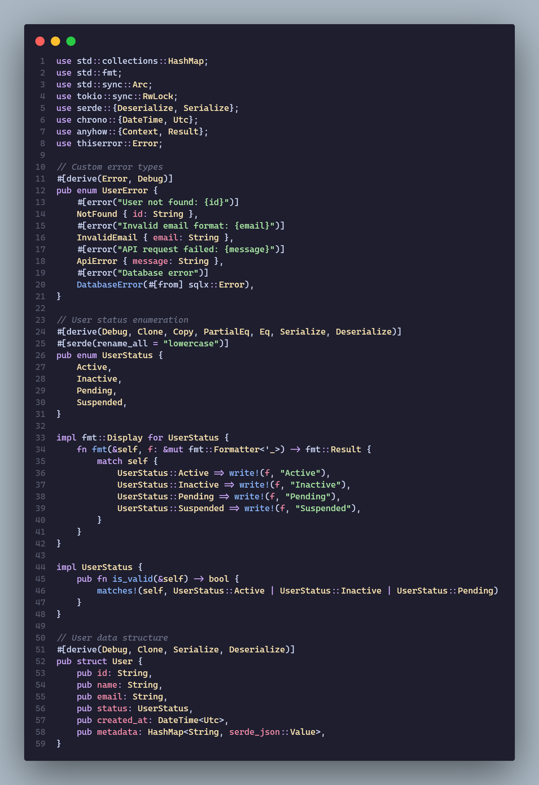
*Lifetime annotations, ownership patterns, and macro highlighting*
</details>

<details>
<summary><strong>🔧 C++</strong> - Modern C++ with template and STL support</summary>

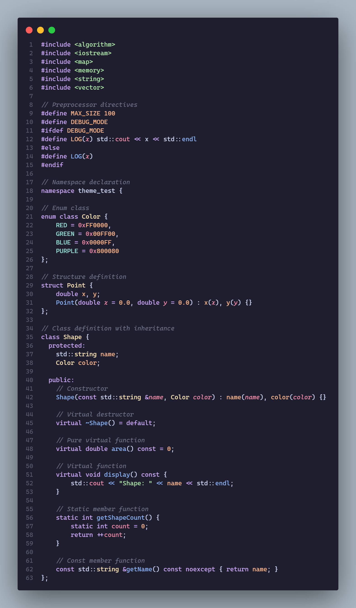
*Advanced template metaprogramming and modern C++ features*
</details>

<details>
<summary><strong>🏃 Go</strong> - Clean, concurrent programming visualization</summary>

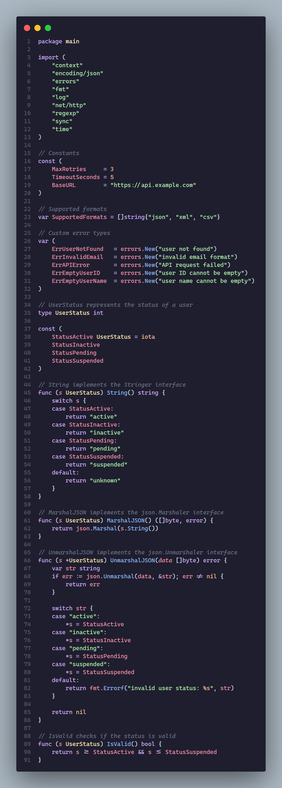
*Goroutines, channels, and interface highlighting for concurrent code*
</details>

### 🏢 **Enterprise & Backend**

<details>
<summary><strong>☕ Java</strong> - Enterprise-grade object-oriented programming</summary>

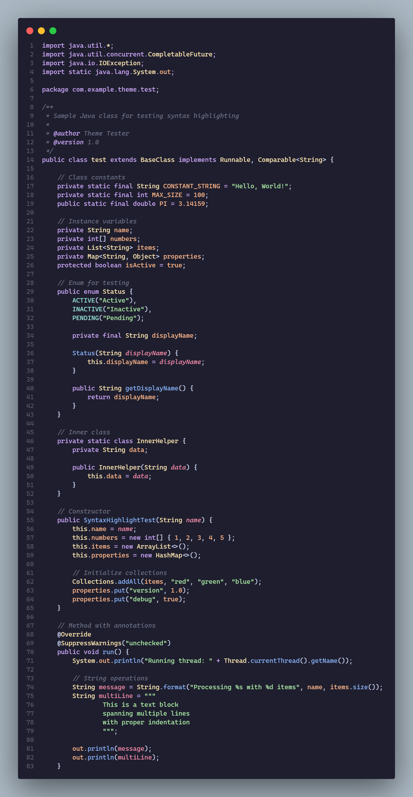
*Annotations, generics, and stream API with perfect class hierarchy*
</details>

<details>
<summary><strong>💎 C#</strong> - Modern .NET development with LINQ beauty</summary>

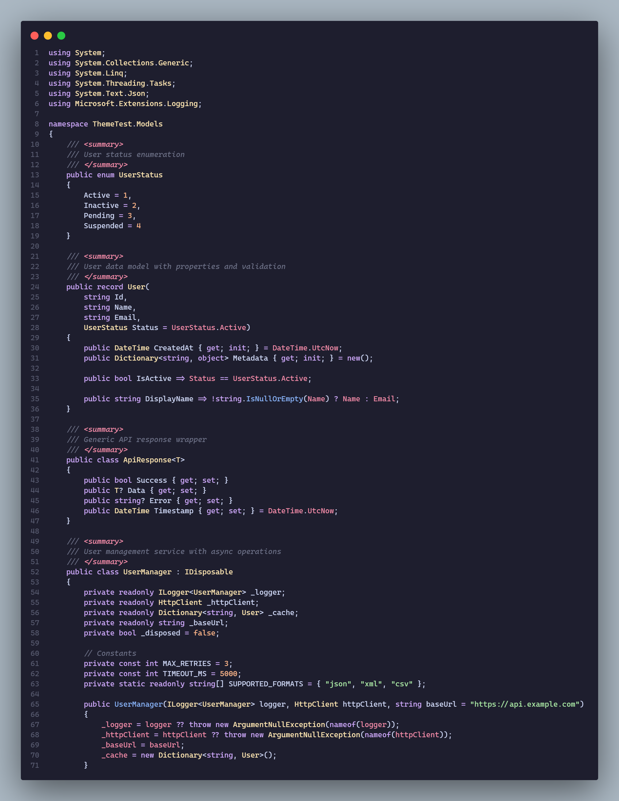
*LINQ expressions, async/await patterns, and attribute programming*
</details>

<details>
<summary><strong>🐍 Python</strong> - Clean, readable code with decorator support</summary>

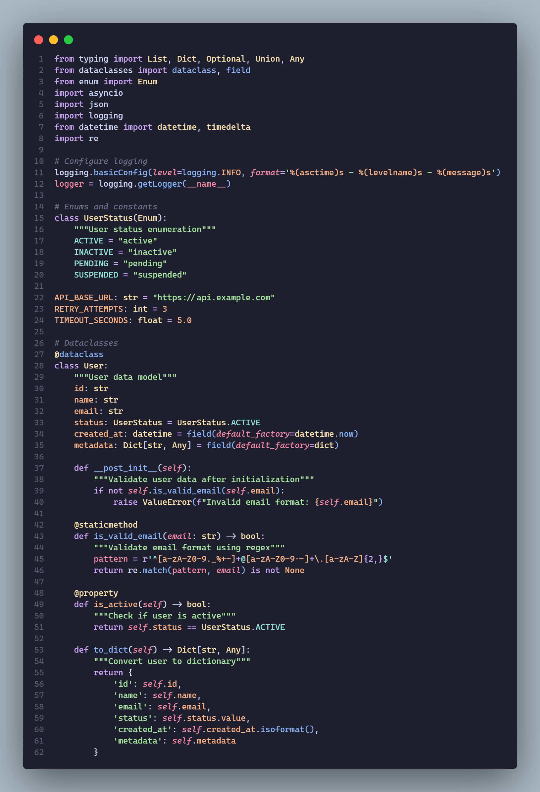
*F-strings, decorators, type hints, and Pythonic patterns*
</details>

### 🌟 **Scripting & Dynamic Languages**

<details>
<summary><strong>🔴 Ruby</strong> - Elegant, expressive programming</summary>

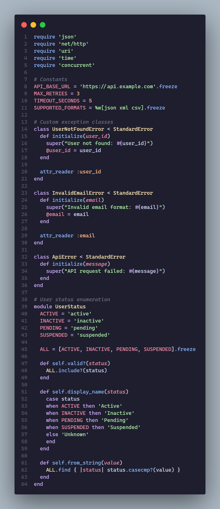
*Blocks, symbols, and metaprogramming with beautiful syntax*
</details>

<details>
<summary><strong>🐘 PHP</strong> - Modern PHP 8+ with namespace support</summary>

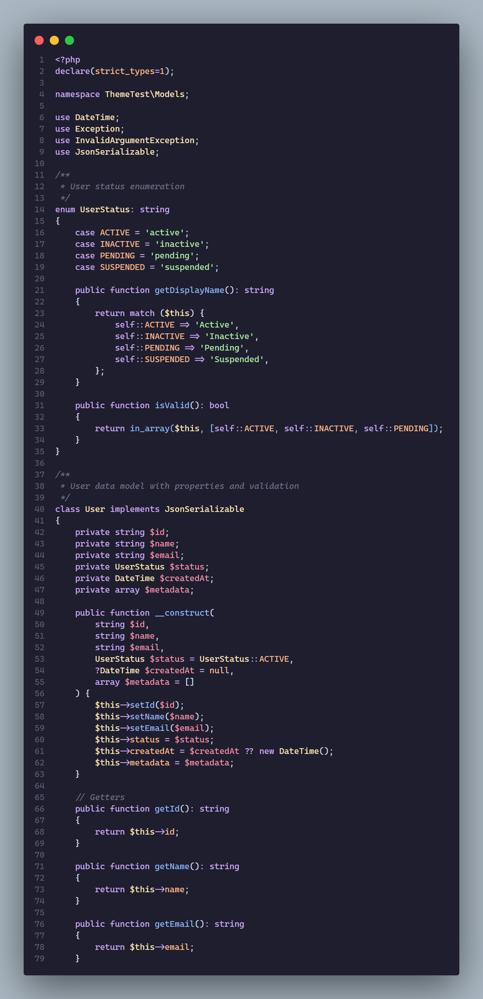
*Namespaces, traits, and modern PHP syntax highlighting*
</details>

<details>
<summary><strong>🌙 Lua</strong> - Lightweight scripting perfection</summary>

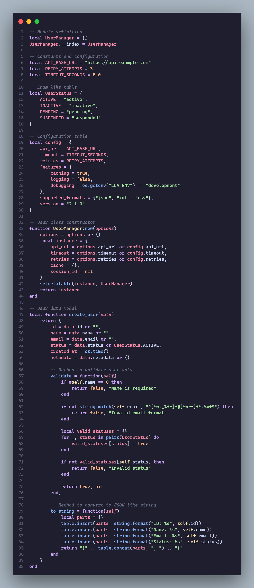
*Tables, coroutines, and metatables with clear function definition*
</details>

### 🎯 **Specialized Languages**

<details>
<summary><strong>🎯 Dart</strong> - Flutter development optimized</summary>

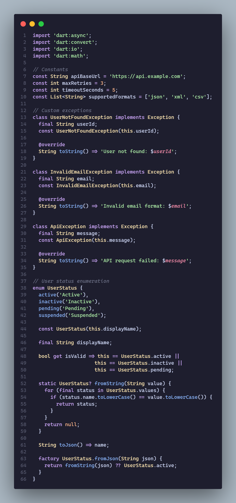
*Widget trees, async patterns, and null safety highlighting*
</details>

<details>
<summary><strong>🗃️ SQL</strong> - Database queries with perfect syntax</summary>

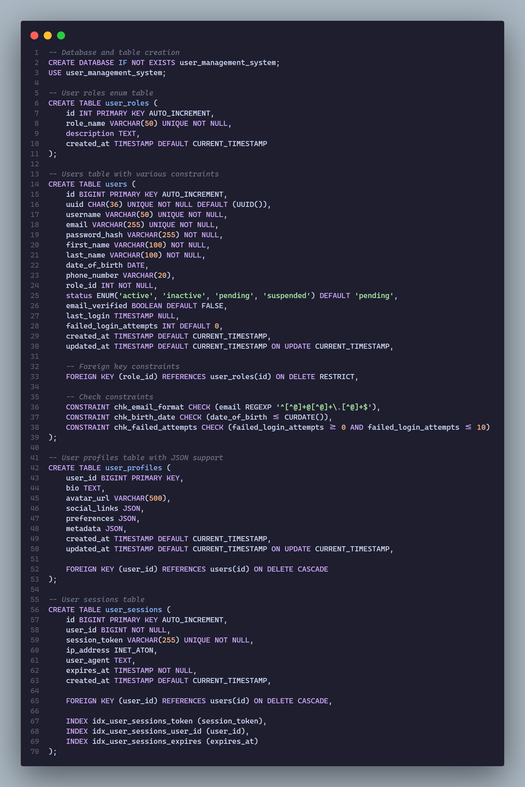
*Keywords, functions, and data types with query structure clarity*
</details>

### 🎨 **Language Highlights**

| Language | Key Features | Special Highlighting |
|----------|-------------|---------------------|
| **JavaScript** | ES6+ features, template literals, destructuring | 🟨 Modern syntax patterns |
| **TypeScript** | Type annotations, interfaces, generics | 🔷 Type safety visualization |
| **Python** | F-strings, decorators, type hints | 🐍 Pythonic elegance |
| **Rust** | Lifetime annotations, ownership, macros | 🦀 Memory safety focus |
| **C++** | Templates, STL, enhanced syntax highlighting | 🔧 **NEW!** Advanced C++ features |
| **Java** | Annotations, streams, lambda expressions | ☕ Enterprise patterns |
| **C#** | LINQ, async/await, attributes | 💎 .NET ecosystem |
| **Go** | Goroutines, interfaces, simplicity | 🏃 Concurrent programming |
| **CSS** | Properties, variables, vendor prefixes | 🎨 Modern web styling |
| **HTML** | Semantic tags, attributes, structure | 📄 Web markup clarity |
| **Dart** | Widget trees, null safety, async | 🎯 Flutter development |
| **Ruby** | Blocks, symbols, metaprogramming | 🔴 Expressive syntax |
| **PHP** | Namespaces, traits, modern features | 🐘 Web backend power |
| **Lua** | Tables, coroutines, lightweight syntax | 🌙 Scripting elegance |
| **SQL** | Queries, functions, data types | 🗃️ Database operations |

## ✨ Key Features

### 🌙 **UI Excellence**

- **Catppuccin Mocha Foundation**: Soft, warm pastel colors for seamless visual flow
- **Ultra-Flat Design**: Completely borderless interface with `#00000000` transparency
- **Strategic Alpha Channels**: Modern minimal aesthetics with depth
- **Scientific Color Mapping**: WCAG-compliant contrast ratios across 50+ UI elements

### 💡 **Syntax Mastery**

- **190+ Token Rules**: Comprehensive highlighting mapped to Catppuccin's elegant palette
- **One Dark Pro Inspired**: Battle-tested readability patterns
- **15+ Languages**: Specialized optimization for modern development
- **🆕 Enhanced C/C++**: Advanced language-specific highlighting with 20+ new rules
  - Preprocessor directives with italic styling
  - Namespace and scope resolution operators
  - Template syntax and angle brackets
  - Lambda expressions and captures
  - Access specifiers and function modifiers
  - Operator overloading and built-in types
- **Framework Awareness**: Smart token recognition for enhanced understanding

### 🧠 **Smart Features**

- **15+ Semantic Tokens**: Enhanced code understanding with IntelliSense integration
- **Language Server Integration**: TypeScript, Python, Rust, Go, C#, Java support
- **Developer-Focused**: Reduced eye strain with optimized contrasts
- **Consistent Philosophy**: Harmonized design across all UI elements

## 🎨 Color Philosophy & Science

This theme implements a sophisticated **dual-layer color mapping system** that perfectly balances **Catppuccin's warm pastel aesthetics** with **One Dark Pro's proven readability patterns**. Every color has been scientifically chosen based on **WCAG contrast guidelines** and **visual hierarchy principles**.

### 🎯 **Core UI Palette** (Catppuccin Mocha Foundation)

| Element | Color Name | Hex Code | Usage & Psychology |
|---------|------------|----------|-------------------|
| **Base** | Mocha Base | `#1e1e2e` | Primary editor background - deep, warm foundation |
| **Mantle** | Mocha Mantle | `#181825` | Secondary backgrounds (sidebars, panels) |
| **Crust** | Mocha Crust | `#11111b` | Deepest backgrounds, subtle shadows |
| **Surface0** | Surface 0 | `#313244` | Interactive elements, form controls |
| **Surface1** | Surface 1 | `#45475a` | Hover states, secondary selections |
| **Text** | Mocha Text | `#cdd6f4` | Primary text - optimal readability contrast |
| **Subtext1** | Subtext 1 | `#bac2de` | Secondary text elements, labels |
| **Overlay1** | Overlay 1 | `#7f849c` | Disabled states, subtle information |

### 🌈 **Syntax Highlighting Palette** (Harmonized Mapping)

| Token Category | Color | Hex Code | Example Usage | Design Rationale |
|----------------|-------|----------|---------------|------------------|
| **Keywords & Control** | Mauve | `#cba6f7` | `const`, `function`, `class`, `import`, `if` | Purple conveys structure and control |
| **Functions & Methods** | Blue | `#89b4fa` | Function calls, method names, APIs | Blue represents functionality and action |
| **Classes & Types** | Yellow | `#f9e2af` | Class names, interfaces, type definitions | Warm yellow for foundational structures |
| **Variables & Parameters** | Red | `#f38ba8` | Variable names, function parameters | Red for dynamic, changeable elements |
| **Properties & Attributes** | Peach | `#fab387` | Object properties, HTML attributes | Orange for descriptive characteristics |
| **Strings & Literals** | Green | `#a6e3a1` | Strings, template literals, content | Green for content and data |
| **Numbers & Constants** | Peach | `#fab387` | Numbers, booleans, null, undefined | Warm orange for literal values |
| **Regex & Special** | Teal | `#94e2d5` | Regular expressions, CSS values | Teal for patterns and special syntax |
| **Comments & Docs** | Overlay1 | `#7f849c` | Comments, documentation | Subtle gray for non-executable text |

### 🎨 **Advanced Color Science**

- **Contrast Ratios**: All text colors maintain WCAG AA compliance (4.5:1 minimum)
- **Alpha Transparency**: Strategic use of alpha channels (22-44%) for depth without visual noise
- **Color Temperature**: Warm base tones (1e1e2e) balanced with cool accent colors for visual comfort
- **Semantic Consistency**: Colors maintain meaning across different contexts and languages

## 🚀 Installation

### 📦 **Marketplace Installation** (Recommended)

```bash
# Quick install via VS Code CLI
code --install-extension catppuccin-dark-pro.catppuccin-dark-pro
```

**Or via GUI:**

1. Open VS Code
2. Open Extensions panel (`Ctrl+Shift+X` / `Cmd+Shift+X`)
3. Search for **"Catppuccin Dark Pro"**
4. Click **Install**
5. Open Command Palette (`Ctrl+Shift+P` / `Cmd+Shift+P`)
6. Type "Color Theme" and select **"Catppuccin Dark Pro"**

### 🔧 **Manual Installation** (Advanced Users)

1. Clone the repository: `git clone https://github.com/catppuccin-dark-pro/vscode.git`
2. Navigate to the project directory: `cd vscode`
3. Install VS Code Extension Manager: `npm install -g @vscode/vsce`
4. Package the extension: `vsce package`
5. Install the generated `.vsix` file: `code --install-extension catppuccin-dark-pro-1.0.2.vsix`
6. Copy the project folder to your VS Code extensions directory:

| Platform | Extensions Directory |
|----------|---------------------|
| **Windows** | `%USERPROFILE%\.vscode\extensions` |
| **macOS** | `~/.vscode/extensions` |
| **Linux** | `~/.vscode/extensions` |

7. Restart VS Code and select the theme via Command Palette (`Ctrl+Shift+P` / `Cmd+Shift+P` → "Color Theme")

### 🎨 **Activation**

1. Open Command Palette (`Ctrl+Shift+P` / `Cmd+Shift+P`)
2. Type "Color Theme" and select **"Preferences: Color Theme"**
3. Select **"Catppuccin Dark Pro"** from the list
4. Enjoy your new theme!

### Syntax Colors (Harmonized Palette)

- **Mauve**: `#cba6f7` - Keywords (`class`, `function`, `import`, `if`)
- **Blue**: `#89b4fa` - Functions, methods, and CSS properties
- **Peach**: `#fab387` - Constants, numbers, and object properties
- **Yellow**: `#f9e2af` - Classes, types, and Python decorators
- **Red**: `#f38ba8` - Variables, parameters, and HTML tags
- **Green**: `#a6e3a1` - Strings and string literals
- **Teal**: `#94e2d5` - Regular expressions and CSS values
- **Overlay**: `#7f849c` - Comments with elegant italic styling

## 🧠 Advanced Semantic Highlighting

### **Intelligent Code Understanding**

Catppuccin Dark Pro features **15+ semantic token definitions** that work with VS Code's language servers to provide enhanced syntax highlighting that understands your code's meaning, not just its structure.

| Semantic Token | Color | Hex | Description | Languages |
|----------------|-------|-----|-------------|-----------|
| **annotation** | Peach | `#fab387` | Decorators and annotations | Dart, Java, Python |
| **enumMember** | Teal | `#94e2d5` | Enum values and constants | All languages |
| **macro** | Peach | `#fab387` | Preprocessor macros | C/C++, Rust |
| **memberOperatorOverload** | Mauve | `#cba6f7` | Operator overloads | C++, C# |
| **variable.constant** | Peach | `#fab387` | Immutable variables | All languages |
| **variable.defaultLibrary** | Yellow | `#f9e2af` | Built-in library variables | JavaScript, Python |
| **variable.readonly** | Peach | `#fab387` | Read-only variables | TypeScript, C# |
| **class** | Yellow | `#f9e2af` | Class definitions | All OOP languages |
| **function** | Blue | `#89b4fa` | Function declarations | All languages |
| **parameter** | Red | `#f38ba8` | Function parameters | All languages |
| **property** | Peach | `#fab387` | Object properties | All languages |
| **string** | Green | `#a6e3a1` | String literals | All languages |
| **type** | Yellow | `#f9e2af` | Type definitions | TypeScript, Rust, Go |
| **variable** | Red | `#f38ba8` | Variable references | All languages |
| **keyword** | Mauve | `#cba6f7` | Language keywords | All languages |

### 🌟 **Enhanced Language Server Integration**

| Language | Special Features |
|----------|-----------------|
| **TypeScript** | Enhanced type highlighting, interface distinction, generic parameters |
| **Python** | Decorator support, f-string recognition, type hint visualization |
| **Rust** | Lifetime annotations, trait implementations, macro expansions |
| **Go** | Interface methods, struct fields, package imports |
| **C#** | LINQ expressions, async patterns, attribute usage |
| **Java** | Annotation processing, stream operations, lambda expressions |

## 🎯 Why Choose Catppuccin Dark Pro?

### 🔥 **Feature Comparison**

| Feature | Catppuccin Dark Pro | Standard Catppuccin | One Dark Pro | Generic Themes |
|---------|:------------------:|:-------------------:|:------------:|:--------------:|
| **Ultra-flat UI** | ✅ | ❌ | ❌ | ❌ |
| **Borderless Design** | ✅ | ❌ | ❌ | ❌ |
| **Syntax Harmony** | ✅ 190+ rules | ⚠️ Basic | ⚠️ Limited | ❌ Generic |
| **Semantic Highlighting** | ✅ 15+ tokens | ⚠️ Basic | ⚠️ Limited | ❌ None |
| **Language Specificity** | ✅ 15+ optimized | ⚠️ General | ⚠️ General | ❌ Basic |
| **Eye Strain Focus** | ✅ Scientifically optimized | ⚠️ Standard | ❌ High contrast | ❌ Not considered |
| **WCAG Compliance** | ✅ AA Standard | ❌ | ❌ | ❌ |

### 🚀 **Technical Superiority**

- **🎨 Color Science**: Every color chosen based on contrast ratios and visual harmony
- **⚡ Performance**: Optimized 19.39KB theme file with comprehensive coverage
- **🧠 Semantic Intelligence**: Advanced token recognition for better code understanding
- **🔧 Developer Experience**: Reduced cognitive load with consistent visual patterns
- **📱 Modern Design**: Contemporary flat design principles throughout

## ⚙️ Technical Implementation Details

### 🎯 **Theme Architecture** (v1.0.2)

| Metric | Value | Details |
|--------|-------|---------|
| **File Size** | 19.39KB | Optimized JSON structure |
| **Token Rules** | 190+ | Comprehensive syntax definitions |
| **UI Elements** | 50+ | Interface components styled |
| **Semantic Tokens** | 15+ | Intelligent highlighting definitions |
| **Language Support** | 15+ | Specialized optimization |
| **Compatibility** | VS Code ^1.74.0 | Full backward compatibility |

### 🎨 **Design Philosophy Implementation**

- **Ultra-Flat UI**: All borders set to `#00000000` (completely transparent)
- **Strategic Transparency**: Alpha channels for depth (22%, 33%, 44%)
- **Color Temperature Balance**: Warm base (`#1e1e2e`) with cool accents
- **Semantic Consistency**: Colors maintain meaning across all contexts
- **WCAG Compliance**: All text meets AA accessibility standards

## 🎛️ Customization & Settings

### 🎛️ **Recommended VS Code Settings**

Enhance your experience with these optimized settings:

```json
{
  // 🧠 Enhanced theme integration
  "editor.semanticHighlighting.enabled": true,
  "editor.bracketPairColorization.enabled": true,
  "terminal.integrated.minimumContrastRatio": 1,

  // ✨ Smooth visual experience
  "editor.cursorBlinking": "smooth",
  "editor.cursorSmoothCaretAnimation": "on",
  "workbench.list.smoothScrolling": true,
  "editor.smoothScrolling": true,

  // 📖 Enhanced readability
  "editor.fontLigatures": true,
  "editor.fontSize": 14,
  "editor.lineHeight": 1.6,
  "editor.fontFamily": "'JetBrains Mono', 'Fira Code', 'Cascadia Code', monospace",

  // 🎨 Theme-specific optimizations
  "workbench.colorTheme": "Catppuccin Dark Pro",
  "workbench.iconTheme": "catppuccin-mocha",
  "editor.minimap.enabled": true,
  "editor.minimap.showSlider": "always"
}
```

### 🎨 **Color Customization**

Personalize specific colors in your `settings.json`:

```json
{
  "workbench.colorCustomizations": {
    "[Catppuccin Dark Pro]": {
      "editor.background": "#1a1a2e",           // Darker background
      "activityBar.background": "#16213e",      // Custom activity bar
      "statusBar.background": "#1e1e2e",        // Match editor background
      "titleBar.activeBackground": "#181825"    // Subtle title bar
    }
  },
  "editor.tokenColorCustomizations": {
    "[Catppuccin Dark Pro]": {
      "comments": "#6c7086",                    // Dimmer comments
      "strings": "#a6e3a1",                     // Brighter strings
      "keywords": "#cba6f7",                    // Enhanced keywords
      "functions": "#89b4fa"                    // Vibrant functions
    }
  }
}
```

## 🤝 Contributing & Development

We welcome contributions from the community! Here's how you can help improve Catppuccin Dark Pro:

### **🐛 Bug Reports**

- Use our [GitHub Issues](https://github.com/catppuccin-dark-pro/vscode/issues)
- Include screenshots and VS Code version
- Specify the programming language if syntax-related

### **💡 Feature Requests**

- Suggest new language support
- Propose UI improvements
- Request color palette enhancements

### **🎨 Development Setup**

```bash
# Clone the repository
git clone https://github.com/catppuccin-dark-pro/vscode.git
cd vscode

# Install VS Code Extension Manager
npm install -g @vscode/vsce

# Package the extension
vsce package

# Install locally for testing
code --install-extension catppuccin-dark-pro-1.0.2.vsix
```

### **🔧 Theme File Structure**

```text
themes/catppuccin-dark-pro-color-theme.json
├── semanticTokenColors (15 definitions)
├── tokenColors (190+ rules)
│   ├── Comments & Documentation
│   ├── Strings & Literals
│   ├── Keywords & Operators
│   ├── Functions & Methods
│   ├── Classes & Types
│   ├── Variables & Parameters
│   └── Language-Specific Rules
└── colors (50+ UI elements)
    ├── Editor Interface
    ├── Activity & Status Bars
    ├── Panels & Sidebars
    └── Terminal & Git Integration
```

---

## 📄 License & Acknowledgments

### 📜 **License**

This theme is licensed under the [MIT License](LICENSE).

### 🙏 **Special Thanks**

- **[Catppuccin](https://github.com/catppuccin/catppuccin)** - For the beautiful color palette and UI inspiration
- **[One Dark Pro](https://github.com/Binaryify/OneDark-Pro)** - For the excellent syntax highlighting foundation
- **VS Code Community** - For continuous feedback and support

---

## 🎉 **Enjoy Catppuccin Dark Pro!**

*The perfect fusion of aesthetics and functionality for the modern developer*

[](https://github.com/catppuccin-dark-pro/vscode)
[](https://marketplace.visualstudio.com/items?itemName=catppuccin-dark-pro.catppuccin-dark-pro&ssr=false#review-details)
[](https://github.com/catppuccin-dark-pro/vscode/issues)

**Made with ❤️ by the developer community, for the developer community**
